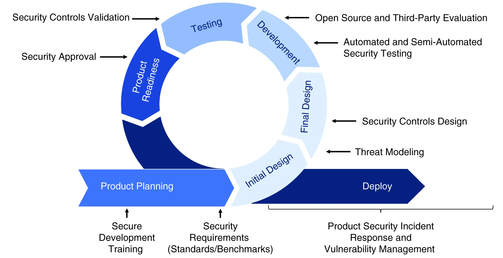

## Talking about Product Security

Let's talk briefly about product security using the following sentence as a basis: **"Product security, like every other “-ility” is best executed when it is considered and built in everywhere and all of the time."**

In the context of software development, **"-ility"** is a suffix used to describe various attributes of a software product. For example:

**Usability:** Refers to how easy and efficient a software product is to use for its intended users.

**Reliability:** Refers to how well a software product performs its intended functions without errors or failures.

**Maintainability:** Refers to how easy and cost-effective it is to maintain and update a software product over its lifetime.

**Scalability:** Refers to how well a software product can handle increased workload or user demand.

**Portability:** Refers to how easily a software product can be moved from one environment or platform to another.

**Compatibility:** Refers to how well a software product works with other software systems and hardware devices.

Therefore, when someone talks about an "-ility" in the context of software development, they are likely referring to one of these attributes that contribute to the overall quality and success of a software product.

That said, the above sentence means that just like any other attribute that is important to the success of a product, such as usability, reliability, maintainability, etc., product security must also be considered and built into every aspect of the product development process.

In other words, product security should not be an afterthought or an add-on that is addressed only at the end of the product development cycle. Instead, it should be integrated into the design, development, testing, and maintenance of the product from the very beginning. This ensures that security is a fundamental aspect of the product, and not just an optional feature. By building security in everywhere and all of the time, the product is more likely to be secure, robust, and trustworthy.